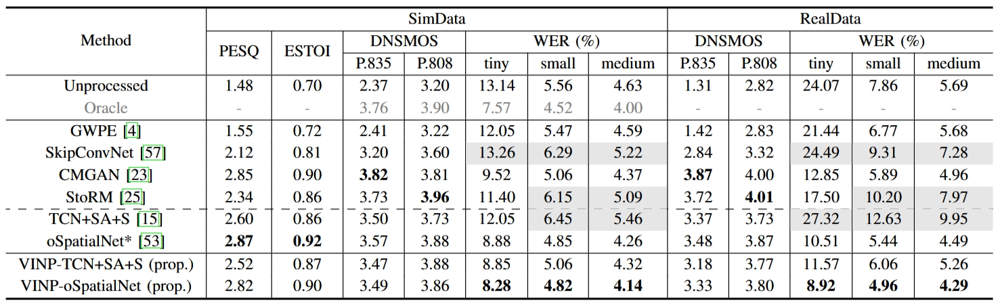
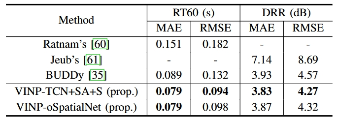

# VINP [Submitted to IEEE/ACM Trans. on TASLP]

## Introduction

This repo is the official PyTorch implementation of **'VINP: Variational Bayesian Inference with Neural Speech Prior for Joint ASR-Effective Speech Dereverberation and Blind RIR Identification'**, which has been submitted to IEEE/ACM Trans. on TASLP.

<!-- [Paper]() | [Code](https://github.com/Audio-WestlakeU/VINP)

## 2. Usage


### 2.1. Prepare Environment

Please see `requirements.txt`.

### 2.2. Prepare Datasets

#### 2.2.1. Training Set and Validation Set

We build the training set and validation set in the same way. 

1. Prepare reverberant and direct-path RIRs using `dataset/gen_rir.py` as
```
python ./dataset/gen_rir.py --[config_key] [config_val] 
```
where the details is provided in `config/rir.json`

2. Prepare a list of file paths (in `.txt` format) for the source speech (in `.wav` or `.flac` format), simulated RIR pairs (in `.npz` format), and noise (in `.wav` or `.flac` format) using `dataset/gen_fpath_txt.py` as
```
python ./dataset/gen_fpath_txt.py --i [folder path] --o [.txt path] --ext [extension name]
```

#### 2.2.2. Test Set for Dereverberation

Prepare the official single-channel test sets of [REVERB Challenge Dataset](https://reverb2014.audiolabs-erlangen.de/).

#### 2.2.3. Test Set for Blind RIR Identification

1. Prepare the RIRs of the 'Single' subfolder in [ACE Challenge](http://www.ee.ic.ac.uk/naylor/ACEweb/).

2. Generate the test set using `dataset/noisy_dataset_1chl_torch_ACE.py` as
```
```


### 2.3. Training

1. Edit the config file (for example: `config/OSPN.toml` and `config/TCNSAS.toml`).

2. Start training as

```
torchrun --standalone --nnodes=1 --nproc_per_node=[number of GPUs] train.py -c [config file path] -p [save path]
```

3. Resume training

```
torchrun --standalone --nnodes=1 --nproc_per_node=[number of GPUs] train.py -c [config file path] -p [save path] -r
```

### 2.4. Pretrained Checkpoints

```
torchrun --standalone --nnodes=1 --nproc_per_node=[number of GPUs] train.py -c [config file path] -p [save path] --start_ckpt [pretrained model file path]
```

### 2.4. Speech Dereverberation and Blind RIR identification

### 2.5. Evaluation

#### 2.5.1 Speech Quality

1. Download the source codes of [DNSMOS](https://github.com/microsoft/DNS-Challenge/tree/master/DNSMOS).

2. When reference waveforms are available, run
```
sh eval/eval_all.sh [reference dirpath] [output dirpath]
```

Otherwise, run 
```
sh eval/eval_all.sh [output dirpath] [output dirpath]
```

#### 2.5.2 ASR Evaluation

#### 2.5.3 RT60 and DRR Evaluation -->

## Results

### Speech Dereverberation Results on REVERB



### Bline RIR Identification Results on SimACE



## DEMO

Please open `README.html` with Microsoft Edge browser or IE borwser to play the recordings.

<table>
<thead>
  <tr>
      <th>Method</th>
      <th colspan="2'">SimData</th>
      <th colspan="2">RealData</th>
  </tr>
  <tr>
      <td>Unprocessed</td>
      <td><a onclick="play(event)" href="AudioSamples/Reverb/c3a_SimData_et_for_1ch_far_room3_A_c3ac0208.flac" style="color:#c9302c">demo1</a> </td>
      <td><a onclick="play(event)" href="AudioSamples/Reverb/c48_SimData_et_for_1ch_near_room3_A_c48c0212.flac" style="color:#c9302c">demo2</a> </td>
      <td><a onclick="play(event)" href="AudioSamples/Reverb/t22_RealData_et_for_1ch_far_room1_A_t22c0211.flac" style="color:#c9302c">demo3</a> </td>
      <td><a onclick="play(event)" href="AudioSamples/Reverb/t40_RealData_et_for_1ch_near_room1_A_t40c0207.flac" style="color:#c9302c">demo4</a> </td>
  </tr>
  <tr>
      <td>Oracle</td>
      <td><a onclick="play(event)" href="AudioSamples/Oracle/c3a_SimData_et_for_1ch_far_room3_A_c3ac0208.flac" style="color:#00FF00">demo1</a> </td>
      <td><a onclick="play(event)" href="AudioSamples/Oracle/c48_SimData_et_for_1ch_near_room3_A_c48c0212.flac" style="color:#00FF00">demo2</a> </td>
      <td></td>
      <td></td>
  </tr>
  <tr>
      <td>GWPE</td>
      <td><a onclick="play(event)" href="AudioSamples/GWPE/c3a_SimData_et_for_1ch_far_room3_A_c3ac0208.flac" style="color:#337ab7">demo1</a> </td>
      <td><a onclick="play(event)" href="AudioSamples/GWPE/c48_SimData_et_for_1ch_near_room3_A_c48c0212.flac" style="color:#337ab7">demo2</a> </td>
      <td><a onclick="play(event)" href="AudioSamples/GWPE/t22_RealData_et_for_1ch_far_room1_A_t22c0211.flac" style="color:#337ab7">demo3</a> </td>
      <td><a onclick="play(event)" href="AudioSamples/GWPE/t40_RealData_et_for_1ch_near_room1_A_t40c0207.flac" style="color:#337ab7">demo4</a> </td>
  </tr>
  <tr>
      <td>SkipConvNet</td>
      <td><a onclick="play(event)" href="AudioSamples/SkipConvNet/c3a_SimData_et_for_1ch_far_room3_A_c3ac0208.flac" style="color:#337ab7">demo1</a> </td>
      <td><a onclick="play(event)" href="AudioSamples/SkipConvNet/c48_SimData_et_for_1ch_near_room3_A_c48c0212.flac" style="color:#337ab7">demo2</a> </td>
      <td><a onclick="play(event)" href="AudioSamples/SkipConvNet/t22_RealData_et_for_1ch_far_room1_A_t22c0211.flac" style="color:#337ab7">demo3</a> </td>
      <td><a onclick="play(event)" href="AudioSamples/SkipConvNet/t40_RealData_et_for_1ch_near_room1_A_t40c0207.flac" style="color:#337ab7">demo4</a> </td>
  </tr>
  <tr>
      <td>CMGAN</td>
      <td><a onclick="play(event)" href="AudioSamples/CMGAN/c3a_SimData_et_for_1ch_far_room3_A_c3ac0208.flac" style="color:#337ab7">demo1</a> </td>
      <td><a onclick="play(event)" href="AudioSamples/CMGAN/c48_SimData_et_for_1ch_near_room3_A_c48c0212.flac" style="color:#337ab7">demo2</a> </td>
      <td><a onclick="play(event)" href="AudioSamples/CMGAN/t22_RealData_et_for_1ch_far_room1_A_t22c0211.flac" style="color:#337ab7">demo3</a> </td>
      <td><a onclick="play(event)" href="AudioSamples/CMGAN/t40_RealData_et_for_1ch_near_room1_A_t40c0207.flac" style="color:#337ab7">demo4</a> </td>
  </tr>
  <tr>
      <td>StoRM</td>
      <td><a onclick="play(event)" href="AudioSamples/StoRM/c3a_SimData_et_for_1ch_far_room3_A_c3ac0208.flac" style="color:#337ab7">demo1</a> </td>
      <td><a onclick="play(event)" href="AudioSamples/StoRM/c48_SimData_et_for_1ch_near_room3_A_c48c0212.flac" style="color:#337ab7">demo2</a> </td>
      <td><a onclick="play(event)" href="AudioSamples/StoRM/t22_RealData_et_for_1ch_far_room1_A_t22c0211.flac" style="color:#337ab7">demo3</a> </td>
      <td><a onclick="play(event)" href="AudioSamples/StoRM/t40_RealData_et_for_1ch_near_room1_A_t40c0207.flac" style="color:#337ab7">demo4</a> </td>
  </tr>
  <tr>
      <td>TCN+SA+S</td>
      <td><a onclick="play(event)" href="AudioSamples/TCN+SA+S/c3a_SimData_et_for_1ch_far_room3_A_c3ac0208.flac" style="color:#337ab7">demo1</a> </td>
      <td><a onclick="play(event)" href="AudioSamples/TCN+SA+S/c48_SimData_et_for_1ch_near_room3_A_c48c0212.flac" style="color:#337ab7">demo2</a> </td>
      <td><a onclick="play(event)" href="AudioSamples/TCN+SA+S/t22_RealData_et_for_1ch_far_room1_A_t22c0211.flac" style="color:#337ab7">demo3</a> </td>
      <td><a onclick="play(event)" href="AudioSamples/TCN+SA+S/t40_RealData_et_for_1ch_near_room1_A_t40c0207.flac" style="color:#337ab7">demo4</a> </td>
  </tr>
  <tr>
      <td>oSpatialNet*</td>
      <td><a onclick="play(event)" href="AudioSamples/oSpatialNet/c3a_SimData_et_for_1ch_far_room3_A_c3ac0208.flac" style="color:#337ab7">demo1</a> </td>
      <td><a onclick="play(event)" href="AudioSamples/oSpatialNet/c48_SimData_et_for_1ch_near_room3_A_c48c0212.flac" style="color:#337ab7">demo2</a> </td>
      <td><a onclick="play(event)" href="AudioSamples/oSpatialNet/t22_RealData_et_for_1ch_far_room1_A_t22c0211.flac" style="color:#337ab7">demo3</a> </td>
      <td><a onclick="play(event)" href="AudioSamples/oSpatialNet/t40_RealData_et_for_1ch_near_room1_A_t40c0207.flac" style="color:#337ab7">demo4</a> </td>
  </tr>
  <tr>
      <td><b>VINP-TCN+SA+S (prop.)</td>
      <td><a onclick="play(event)" href="AudioSamples/VINP-TCN+SA+S/c3a_SimData_et_for_1ch_far_room3_A_c3ac0208.flac" style="color:#337ab7">demo1</a> </td>
      <td><a onclick="play(event)" href="AudioSamples/VINP-TCN+SA+S/c48_SimData_et_for_1ch_near_room3_A_c48c0212.flac" style="color:#337ab7">demo2</a> </td>
      <td><a onclick="play(event)" href="AudioSamples/VINP-TCN+SA+S/t22_RealData_et_for_1ch_far_room1_A_t22c0211.flac" style="color:#337ab7">demo3</a> </td>
      <td><a onclick="play(event)" href="AudioSamples/VINP-TCN+SA+S/t40_RealData_et_for_1ch_near_room1_A_t40c0207.flac" style="color:#337ab7">demo4</a> </td>
  </tr>
  <tr>
      <td><b>VINP-oSpatialNet (prop.)</td>
      <td><a onclick="play(event)" href="AudioSamples/VINP-oSpatialNet/c3a_SimData_et_for_1ch_far_room3_A_c3ac0208.flac" style="color:#337ab7">demo1</a> </td>
      <td><a onclick="play(event)" href="AudioSamples/VINP-oSpatialNet/c48_SimData_et_for_1ch_near_room3_A_c48c0212.flac" style="color:#337ab7">demo2</a> </td>
      <td><a onclick="play(event)" href="AudioSamples/VINP-oSpatialNet/t22_RealData_et_for_1ch_far_room1_A_t22c0211.flac" style="color:#337ab7">demo3</a> </td>
      <td><a onclick="play(event)" href="AudioSamples/VINP-oSpatialNet/t40_RealData_et_for_1ch_near_room1_A_t40c0207.flac" style="color:#337ab7">demo4</a> </td>
  </tr>

</thead>
</table>       

<!-- ## 5. References

## 6. Citations

If you find our work helpful, please cite
```
``` -->