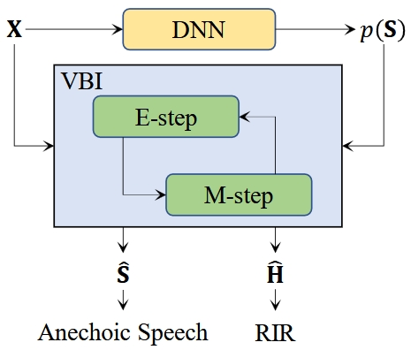
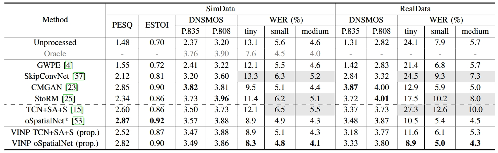
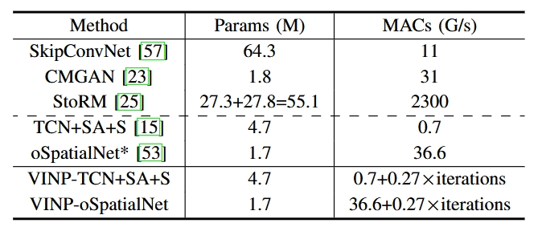

# VINP

## Introduction

This repo is the official PyTorch implementation of **'VINP: Variational Bayesian Inference with Neural Speech Prior for Joint ASR-Effective Speech Dereverberation and Blind RIR Identification'**

[Paper](https://arxiv.org/abs/2502.07205v2) | [Code](https://github.com/Audio-WestlakeU/VINP) | [DEMO](https://audio.westlake.edu.cn/Research/VINP.htm) 

This work proposes a variational Bayesian inference framework with neural speech prior for joint ASR-effective speech dereverberation and blind RIR identification. By combining the prior distribution of anechoic speech predicted by an arbitrary discriminative dereverberation DNN with the reverberant recording, VINP employs VBI to solve the proposed CTF-based probabilistic graphical model and further estimate the anechoic speech and RIR. The usage of VBI avoids the direct utilization of DNN output but still utilizes its powerful nonlinear modeling capability, and proves to be effective for ASR without any joint training with the ASR system. Experimental results demonstrate that the proposed method achieves superior or competitive performance against the SOTA approaches in both tasks. 



## Performance

**Speech Dereverberation Results**




**Blind RIR Identification Results**


**Computational Cost**



## Before Training

**Requirements**

- Please see `requirements.txt`.

**Prepare Training Set and Validation Set**

- Prepare clean source speech and noise recordings in .wav or .flac format.

- Prepare reverberant and direct-path RIRs
```
python dataset/gen_rir.py -c [config/config_gen_rir.json]
```

- Save the list of filepath for the source speech, simulated RIR (.npz), and noise to .txt file
```
python datset/gen_fpath_txt.py -i [dirpath] -o [.txt filepath] -e [filename extension]
```

**Prepare Test Set for Dereverberation**

- Prepare the official single-channel test sets of [REVERB Challenge Dataset](https://reverb2014.audiolabs-erlangen.de/).

**Prepare Test Set for Blind RIR Identification**

- Prepare the RIRs of the 'Single' subfolder in [ACE Challenge](http://www.ee.ic.ac.uk/naylor/ACEweb/).

- Downsample the RIRs to 16kHz
```
python datset/gen_16kHz_ACE_RIR.py -i [ACE 'Single' dirpath] -o [saved dirpath]
```

- Save the list of filepath for the source speech, ACE RIR, and noise to .txt file
```
python datset/gen_fpath_txt.py -i [dirpath] -o [.txt filepath] -e [filename extension]
```

- Generate the test set (consists of reverberant speech and labels)
```
python dataset/gen_SimACE_testset.py --[keyword] [arg]
```


## Training

- Edit the config file (for example: `config/config_VINP_oSpatialNet.toml` and `config/config_VINP_TCNSAS.toml`).

- Run

```
# train from scratch
torchrun --standalone --nnodes=1 --nproc_per_node=[number of GPUs] train.py -c [config filepath] -p [saved dirpath]

# resume training
torchrun --standalone --nnodes=1 --nproc_per_node=[number of GPUs] train.py -c [config filepath] -p [saved dirpath] -r 

# use pretrained checkpoints
torchrun --standalone --nnodes=1 --nproc_per_node=[number of GPUs] train.py -c [config filepath] -p [saved dirpath] --start_ckpt [pretrained model filepath]
```


## Inference

- Run
```
python enhance_rir_avg.py -c [config filepath] --ckpt [list of checkpoints] -i [reverberant speech dirpath] -o [output dirpath] -d [GPU id]
```


## Evaluation


**Speech Quality**

- For SimData, run
```
bash eval/eval_all.sh -i [speech dirpath] -r [reference dirpath]
```

- For RealData, the reference is not available. Run 
```
bash eval/eval_all.sh -i [speech dirpath]
```


**ASR**

- For SimData, run
```
python eval/eval_ASR_REVERB_SimData.py -i [speech dirpath] -m [whisper model name (tiny small medium)]
```

- For RealData, run
```
python eval/eval_ASR_REVERB_RealData.py -i [speech dirpath] -m [whisper model name (tiny small medium)]
```

**RT60 and DRR**

- Estimate RT60 and DRR using
```
python estimate_T60_DRR.py -i [estimated RIR dirpath]
```

- Run
```
python eval/eval_T60_or_DRR.py -o [estimated RT60 or DRR .json] -r [reference RT60 or DRR .json]
```
Evaluation results are saved to the output folder.


## Citation

If you find our work helpful, please cite
```
@misc{wang2025vinpvariationalbayesianinference,
      title={VINP: Variational Bayesian Inference with Neural Speech Prior for Joint ASR-Effective Speech Dereverberation and Blind RIR Identification}, 
      author={Pengyu Wang and Ying Fang and Xiaofei Li},
      year={2025},
      eprint={2502.07205},
      archivePrefix={arXiv},
      primaryClass={eess.AS},
      url={https://arxiv.org/abs/2502.07205}, 
}
```